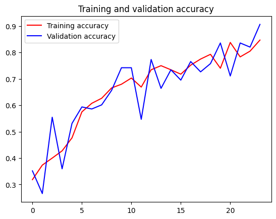
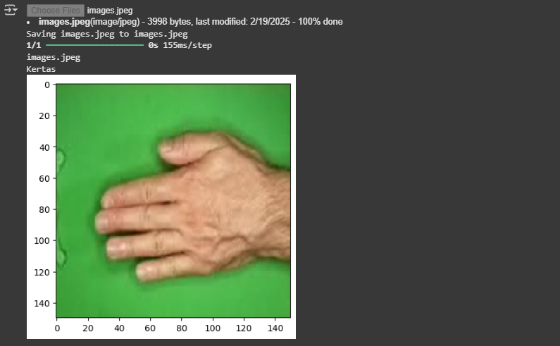

# IMAGE CLASSIFICATION WITH CNN

This project implements a Convolutional Neural Network (CNN) to classify images from the well-known game Rock, Paper, Scissors. The model is trained using TensorFlow and Keras to recognize hand gestures representing these three classes.

## Data Source

 https://github.com/dicodingacademy/assets/releases/download/release/rockpaperscissors.zip-O/content/rockpaperscissors.zip

## Project Goal
- Create a python code to predicting a image of rock paper scissors
- Implementing python library such as keras and tensorflow to process the image 
- The number of validation accuracy needs to be above 90%

## Tech Stack

- Python,
- Google Colaboratory    
- Keras
- Numpy
- Tensorflow

## Model Architecture and Summary

The CNN model consists of the following layers:
- Input Layer: Accepts images of shape (150, 150, 3) (RGB images).
- Convolutional Layers: Extract features using 3 convolutional layers with increasing filters.
- MaxPooling Layers: Reduce spatial dimensions after each convolution.
- Flatten Layer: Converts feature maps into a single vector.
- Dropout Layer (0.5): Prevents overfitting.
- Fully Connected (Dense) Layers:
    - 128 neurons (ReLU activation).
    - 512 neurons (ReLU activation).
    - 3 neurons (Softmax activation for multi-class classification).
- Output: Predicts one of the three classes (Rock, Paper, Scissors).

| Layer Type      | Filters  | Kernel Size  | Activation | Output Shape |
| :-------------- | :------- | :----------  | :--------- | :----------- |
| `Conv2D`       | `16      `| `3, 3  `     | `Relu `    | `148, 148, 16`|
| `MaxPooling2D` | `-      ` | `2, 2  `         | `- `        | `74, 74, 16 `        |
| `Conv2D`       | `32     ` | `3, 3  `         | `RelU `        | `72, 72, 32  `        |
| `MaxPooling2D` | `-   ` | `2, 2  `         | `- `        | `36, 36, 32  `        |
| `Conv2D`       | `32      ` | `3, 3  `         | `RelU `        | `34, 34, 32   `        |
| `MaxPooling2D` | `-      ` | `2, 2  `         | `- `        | `17, 17, 32  `        |
| `Flatten`      | `-      ` | `-  `         | `- `        | `9248   `        |
| `Dropout (0.5)`| `-      ` | `-  `         | `- `        | `9248   `        |
| `Dense`        | `128     ` | `-  `         | `RelU `        | ` 128  `        |
| `Dense`        | `512      ` | `-  `         | `RelU `        | ` 512  `        |
| `Dense (Output)`| `3      ` | `-  `         | `Softmax `        | ` 3  `        |

## Project Ouput

`Validation Accuracy `

`Prediction Result ( Kertas stand for Paper ) `

